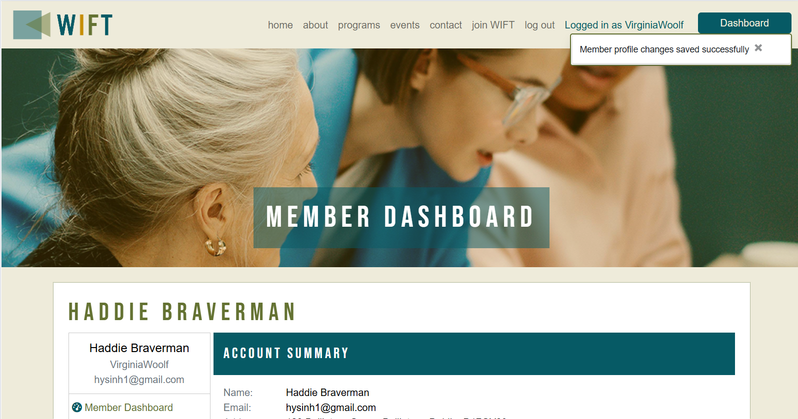

# WIFT - Women in Film and Television Application
  

  [View Live Project Here](https://wift-nsmith-c3ae5713a782.herokuapp.com/)
 
## Introduction
The Guild of Women in Film & Television - Ireland, or WIFT, website is a full-stack, e-commerce-based, web application created with HTML, CSS, JS, Python, the Django web framework and the Bootstrap library. This website application allows user to view the programs and events available to the creater WIFT community and encourages women in the industry to join the organisation for access to it's networking opportunities and access to educational and mentoring opportunities. Visitors to the website are able to view events, programs, and membership opportunities on the website. If the user chooses to join, they can select a membership level, register as a site user, and purchase this membership online. This purchase and registration allows the user to access a member dashboard that allows them to manage their personal details, their public profile published in a member directory, and to view that member directory as well as past membership purchases.

I was approached before I began this course by a similar organisation to WIFT. They requested a bid for the redesign of their current website. Although I ultimately declined to bid for the project, I wanted to use the idea for this project as the starting point for my own work to investigate how I would develop and code the backend of a similar project.

## CONTENTS  
  
* [User Experience](#user-experience)
  * [Project Goals](#project-goals)
  * [User Stories](#user-stories)
  * [Site Admin Stories](#site-admin-stories)
* [Marketing Plan](#marketing-plan)
  * [Social Media](#social-media)
* [Agile Methodology](#agile-methodology)
  * [Kanban Board](#kanban-board)
  * [UI Design](#design)
  * [Database Design](#database-design)
* [Features](#features)
* [Future Development](#future-development)
* [Technologies](#technologies)
  * [Languages and Libraries Used](#languages-and-libraries-used)
  * [Technologies and Programs Used](#technologies-and-programs-used)
  * [Deployment](#deployment)
* [Testing](#testing)
* [Credits](#credits) 

  
---   

## User Experience
The goal of the WIFT website is to provide a business and membership management tool that allows this organisation to engage meaningfully with it's members and the greater film and television industry and supporters. The website offers information about WIFT events, programs, as well as membership opportunities that the visitor can purchase for additional access to the WIFT community and membership directory. Once the user registers on the website and purchases a membership, they can access and manage their personal information, create/view/edit/delete their public profile that is published in a membership directory only accessible to members.

I chose this very specific idea because I was approached by a similar Irish organisation to redesign their website. Although I declined to put in a proposal, I thought it was a good opportunity to apply the knowledge that I have gained from this course to solving some of the membership and access needs of an organisation like this. 

- ### Project Goals
  - Create a shopping cart system that allows clients to register for the site and purchase a membership with the WIFT organisation.
  - Create a website that offers information about on-going and up-coming events and programs relevant to women in the film and television industry.
  - Create a dashboard that member to manage their personal data and public profile (create/edit/delete) as well as view all their past membership purchases in a manageable way.
  - Create an admin portal where staff could manage the membership data of all the members, view membership purchases, and messages via the contact form.
  - Create a website that was responsive and attractive

- ### Visitor Goals
  As a user, I want to easily view upcoming events and programs as well membership options at WIFT and be able to purchase a membership as well as manage my personal information once I am a member.

- ### User Stories
  1. As a Site User, I cam view information about the organisation.
  2. As a Site User, I can view membership levels and benefits and find out how to sign up with WIFT.
  3. As a Site User, I want to view information on public programs and events so that I can attend or participate in WIFT events and programs.
  4. As a Potential Registered User, I can register for an account so that I can access begin the first step of membership.
  5. As a Registered User, I can easily log in or out or recover my password.
  6. As a Registered user, I receive an email confirmation after registering to verify that my account registration was successful.
  7. As a Registered User, I can purchase a specific membership based on my membership needs and professional level.
  8. As a Registered User, I can easily select a membership, view the selected membership in a shopping basket, and easily checkout.
  9. As a Registered user, I will see a confirmation that my purchase was successful and verify that I purchased the correct membership.
  10. As a Registered user, I will receieve an email confirmation after my purchase is complete and can keep this information for my records.
  11. As a visitor, I can see customized error pages for 404 and 500 errors so that I can understand what happened and take the appropriate action.

  ### Site Admin Stories
  1. As a site admin, I can create and manage personal information for the members of the WIFT organisation.
  2. As a site admin, I add/update/delete membership options so that the most updated membership options are available for the site users to purchase.
  3. As a Super User or Admin, I can access the admin panel/dashboard so that I can edit member information and make/edit/review/update/delete member data.
  4. As a Site admin, I can view messages sent to the organisaiton via the website contact form.

## Marketing Plan
WIFT is a non-profit organisation that focuses on the professional community of women who work in the film and television industry. The organisation provides professional development opportunities, networking, and support for women in the industry through coordination with other organisations and events.

An organisation like WIFT is generally funded by grants and similar funding as well as annual membership fees/dues from their members. As such, to provide value to their members, WIFT organises activities such as promote the work of their members and provide opportunities for their members to network with each other and the greater film and television industry. WIFT continues to design dynamic program of high value to its members and the greater community and utilises these events and activities to promote membership to its niche target demographic.

### Social Media
As part of their marketing/public relations strategy, WIFT utilises social media like Facebook and Instagram to connect with members and the greater film and television community to promote events, member's work, and WIFT programming.

  
Facebook
  

  
  

  

## Agile Methodology
The Agile Methodology was the project management approach used for this project. I attempted to break the project into phases and followed a cycle of planning, executing, and evaluating. I struggled with how to organise this properly on our Portfolio Project #4. So, I hope I was more successful with my final project.

All issues/user stories began in the Backlog section. As I got to a section, I moved issues from the backlog into the "Ready" section and as I began work on that specific issue, I moved it into the "In progress" section. As issues were resolved, they were moved into the "Done" column.

I also implemented the MoSCoW prioritisation scheme (Must Have, Should Have, Could Have, and Won't Have). 

- ### Kanban Board 
  I used the GitHub Project board to design and manage a [Kanban Board](https://github.com/users/hysinh/projects/6)
  

  
Kanban Board screenshot
  

  
  

- ### Issues
  I had 26 issues:
  - 4 Epics:
    - Epic 1:
      - Preliminary Work - Research / Planning for site development
    - Epic 2:
      - Web Development - Static pages
      - Web Dev Authorisation and Authentication
    - Epic 3:
      - Purchasing and Checkout
      - Member Admin
      - Web Admin
    - Epic 4:
      - Testing/Assessment
  - Must Haves
    - Edit/Update a member's private and public profiles as site admin
    - Easily update their private profile as a registered user
    - Have a personalised user profile as a registered user
    - View the selected membership level to be purchased in the basket as a vistor
    - Easily select the membership level that I want as a potential member
    - Purchase a membership as a registered user
    - Receive an email confirmation after registering as a registered user
    - Easily log in or log out as a registered user
    - Easily register for a user account as a potential member
    - View the levels of membership and benefits as a potential member
    - view information about the organisation as a site visitor
    - Research and design UX/UI
    - Write website content
    - Access the public pages
  - Should Haves
    - Easily renew my membership as a member
    - Easily see my membership level and when it was purchased
    - Receive an email confirmation after checkout
    - View a purchase confirmation after checkout
    - Feel my personal and payment information is safe and secure
    - Easily recover my password in case I forget it
    - Easily contact the organisation
    - Easily find the contact information for the organisation
    - Find information on public programs
    - Create User Stories
    - Create ERD - Entity Relationship Diagrams
    - Delete a member
    - View a Public version of the Membership list
  - Could Haves
    - View Public Events
    - Add/Edit/Delete WIFT events
    - Automated Testing

### UI Design
  I began my design phase with creating a flow chart, then designing the Entity Relationship Diagram for the database tables. After creating the flow of the website, I drew wireframes for the majority of the pages. Then I designed the user interface in Adobe Photoshop to set the style for the website. 

  

  
Flowchart
  
  
  
  

  

  
UX Wireframe 1
  

  
  

  

  
UX Wireframe 2
  

  
  

  

  
UX Wireframe 3
  

  
  

  

  
UI Mockup
  

  
  

  

  
Color Scheme
  

  
  

  #### Font Family
  For the body and majority of the website, Poppins was used for it's readability and versatility. For the main headers, I used Bebas Neue in upper caps. For the WIFT logo/brand, I used a font called US 101. I wanted an clean, strong, serif typeface that gave the brand the weight and modern look I wanted to convey for a contemporary but serious feeling.
  

  
Fonts
  

  
  

  #### Responsiveness
  The WIFT website needed to be responsive and available on a variety of screen sizes and devices to make it as accessible as possible. Although I made some small adjustments for sizes outside the ones listed below, I mainly focused on the following sizes:

  1. Mobile Device dimensions (larger): 375px and larger
  2. Tablet Device dimensions: 768px and larger
  3. Laptop Device dimensions: 992px and larger

### Database Design
Custom models were created for Membership Purchases, Member Private Data, Member Public Data, Membership Categories, and Messages (sent via the contact form).

Entity Relationship Diagram
  

## Features
### Navbar - top navigation
The navbar incorporates the logo and a responsive navbar that collapses to a hamburger when a device is less than a tablet. The navigation options provide the user with all of their potential navigation options including logging into the member dashboard to create and/or manage their personal data. If a user is logged in, their user name is displayed adjacent to the navbar and they have access to a dashboard button.

Public navbar
  

Registered user navbar (logged in)

 

### Home Page
The Home page provides a featured image of a woman with film camera as well as some highlights of the website content. Links direct visitors to visit the events page, the program-fellowships page, and the membership/join page.

Home Page - Featured Image

Home Page - Website highlights with short descriptions

### About Page
The About page provides basic information about WIFT and emphasises the educational and advocacy goals of the organisation and it's support for the community of women in the film and television industry in Ireland. 

About page

### Events Page
The Events page provides information about upcoming events that feature work by members or in support of the work of women in film and television in the community. These can be film viewings, film festivals organised with other organisations, brown bag lunches, lectures, seminar, and other educational or networking opportunities relevant to members and the public.

Events page

### Fellowships Page
The Fellowships page provides information about some of the professional training and educational opportunities organised by WIFT for the community. 

Fellowships page

### Mentorship Page
The Mentorship Page provides information about the unique one-on-one relationship that WIFT fosters to help junior or rising professionals in the WIFT community gain access to experienced professionals and peers and their wealth of knowledge.

Mentorships page

### Join Page
The Join page provides all the different available Membership levels, their benefits, and the unique offerings for each level designed to suit the different levels of students and professionals who might be interested in joining the WIFT community.

Join page

Membership levels

### Contact Page
The Contact page features basic contact information for WIFT and telephone details. The Contact page also features a contact form that allows the vistor to ask questions or to send a message to WIFT staff by completing the form. The information is stored in the database and the messages accessible to staff members via the Admin panel.

Contact Page

Contact form

### Member Dashboard
The Member Dashboard is special interface that members can view their membership details, edit personal details like their address, and create a public profile that displays in the Member Directory. At this time, the Member Directory is only accessible to members.The Member Dashboard features a dashboard navigation on the left that allows a member to navigate to view purchase receipts, edit their personal data, create/edit their public profile, view the membership directory, and log out of the membership dashboard. On the dashboards main page, the member can view their current personal details, their public profile details if they have one, and their most recent membership purchase.

Member Dashboard

### View Member Purchase Receipts
A member can view their membership purchase receipts. The receipts display the membership level purchased, the total cost, the purchase date, and the renewal date.

View Purchase Receipts

### Edit Member Account Information Page
A member can edit their Account information created when they made their membership purchase. If the member attempts to save their information with any required fields missing, they receive an error message displayed in the upper right corner of the page. If their page was saved successfully, they will also see a success message displayed in the same corner.

Edit Member Account Information page

Edit Acount information success message

Edit Booking error message

### Create/Edit/Delete Public Profile
A member can create and then edit or delete their public profile from the dashboard navigation menu. If the member attempts to save their public profile with an required fields missing, they will see an error message in the upper right hand corner of the screen. If the member clicks on the delete profile link, a pop window will appear to confirm that they want to delete the profile. A confirmation message of the deletion will appear in the upper right corner of the screen.

Create Public Profile

Edit Public Profile Error

Edit Public Profile Success

### Member Directory
A member can view the member directory which willd display all the public profiles of the current WIFT membership.

Member Directory

### Sign In Page
A user is prompted to sign in when they attempt to make a membership purchase or click on the login button.

Sign in Page

### Sign Out Page
The member can sign out at any point.

Sign Out Page

### Register Page
If the user wishes to purchase a WIFT membership, they will be prompted to register for an account in order to complete the order process.

Register Page

### Footer
The footer contains a newsletter sign up box that is linked to MailChimp. The footer also contains two social media links and a link to the privacy page.

Footer

### Privacy Page
A Privacy Policy page communicates the WIFT privacy policy.

Privacy Policy

### 404 Error Page
If the user attempts to navigate to a non-existing page, the 404 Error page will display.

404 Error Page

### Future Development
- For future development, I would like to allow users to upload an image to their profile. I also envisioned that their public profiles would be more comprehensive with potentially allowing other members to contact them. I think that there would also be value to having a listing of the member directory that public displays as motivation to potential members to access the full member directory once they purchase a membership.
- Also due to time constraints, I was unable to create an app for the events section as I would like site admins to be able to add events to event tab that provide more comprehensive information and display a calendar of events for easy search. A member dashboard version would display events that are only open to members and potentially members at different membership levels to provide programming geared more specifically to women where at different levels of their professional journey.

## Technologies
  ### Languages and Libraries Used
  - HTML, CSS, Javascript, Python, Django Web Framework, and Bootstrap Library
  - Django Crispy Forms, Django Summernote
  - Gunicorn 
  - Whitenoise - allows web app to serve static files

  ### Technologies and Programs Used
  - GitHub - used to save and store all the files for this website
  - VSCode - was used as the IDE to develop and test the code for this website in both the cloud and locally.
  - Git - provided the version control
  - Heroku - provided the cloud deployment environment shell and Command Line Interface (CLI)
  - draw.io - used for flowchart creation
  - W3C HTML validator
  - W3C Jigsaw
  - Jshint Linter
  - Code Institute PEP8 Python Linter
  - https://www.drawio.com/ for Entity Relationship Diagramming
  - Adobe Photoshop - mockups and image editing
  - Google Lighthouse - SEO Assessments

  ### Deployment
  GitHub and Heroku was used to deploy this website using the Gitpod Code Institute template which preloads any required dependencies. The following steps were taken:

  
  1. Log into GitHub account. 
  2. Navigate to the project repository: [WIFT](https://github.com/hysinh/wift)
  3. Navigate to the CODE link on the navigation across the top.
  3. Then, navigate to the green CODE button on the right side and click.
  4. Select the Local tab and click on the copy icon to make a copy of the repository.
  5. Log into Heroku.com account.
  6. Navigate to the "New" button on the top right.
  7. Click on "New" and then click on "Create a new app".
  8. On the next page, create a unique App name for your deployment and choose a region. Then, click on the "Create app" button.
  9. Once your app has been created, it directs you to a new screen.
  10. Navigate across the top of the screen and click on the "Settings" tab.
  11. Navigate down the page and click on the "Reveal Config Vars" button.
  12. Add in the keys and values for all the database and stripe secret keys.
  16. After this is complete, navigate to the Deploy tab from the menu across the top of the page. Click on "GitHub" under Deployment method and provide the required access when prompted.
  17. Choose Automatic or Manual deployment.
  18. Click "Deploy" when ready to deploy.

  #### How to clone the WIFT site & make changes:
  1. Open the [WIFT repository](https://github.com/hysinh/wift) on GitHub.
  2. Navigate to the CODE link on the navigation across the top.
  3. Then, navigate to the green CODE button on the right side and click.
  4. Select the Local tab and click on the copy icon to make a copy of the repository.
  5. Then navigate back to your main GitHub dashboard and then create a new repository with your desired name.
  6. On the next page, navigate to the bottom of the page and select Import code under "Import code from another repository".
  7. In the next window, paste the copied link of the [WIFT](https://github.com/hysinh/wift) into the line.
  8. Then, click Begin Import to import the repository code.
  9. Make changes and/or deploy as desired.
  10. This program requires the use of a postgres database, the Django Webframe work, Bootstrap CSS library, Django Crispy Forms, Gunicorn, and Django Summernote.

  ## Testing
  Please view all the testing documentation in [TESTING.md](TESTING.md)

  
## Credits
### Code
- I reused the delete modal used in in the Code Institute Django Blog walk through project.
- I also reused some small portions of the Code Institute Django Boutique Ado walkthrough project such as the loading spinner and the toasts.
- I used the Stripe.com code to set up the Stripe payment system.
- https://www.xml-sitemaps.com/ for generating the sitemap.xml file.
- [Bootstrap](https://getbootstrap.com/docs/4.6/getting-started/introduction/)

### Content
- https://fonts.google.com/
- https://fontawesome.com/  

- #### Images - [Pexels](https://www.pexels.com/) was my primary image source
  - Photo by Alexander Suhorucov: https://www.pexels.com/photo/multiethnic-cheerful-colleagues-talking-about-job-and-working-with-documents-6457515/
  - Photo by cottonbro studio: https://www.pexels.com/photo/a-woman-holding-a-camera-5265827/
  - Photo by cottonbro studio: https://www.pexels.com/photo/woman-in-white-long-sleeve-shirt-sitting-beside-woman-in-blue-long-sleeve-shirt-5990042/
  - Photo by cottonbro studio: https://www.pexels.com/photo/group-of-people-having-a-meeting-6896221/
  - Photo by Daniel Xavier: https://www.pexels.com/photo/selective-focus-photography-of-woman-1239288/
  - Photo by Christina Morillo: https://www.pexels.com/photo/two-woman-sitting-on-sofa-while-using-laptops-1181274/
  - Photo by Christina Morillo: https://www.pexels.com/photo/woman-smiling-and-holding-teal-book-1181424/
  - Photo by Following NYC: https://www.pexels.com/photo/video-tape-12004627/
  - Photo by Dani Hart: https://www.pexels.com/photo/women-sitting-on-chairs-inside-a-room-3719037/
  - Photo by Isaac Udoye: https://www.pexels.com/photo/close-up-shot-of-camera-screen-14121867/
  - Photo by Jaycee300s : https://www.pexels.com/photo/female-fashion-model-posing-in-front-of-a-movie-camera-14783477/
  - Photo by Lê Minh: https://www.pexels.com/photo/woman-in-black-top-and-black-cap-3062606/
  - Photo by Lê Minh: https://www.pexels.com/photo/photo-of-man-holding-camrea-3062539/
  - Photo by Ron Lach : https://www.pexels.com/photo/clapperboard-in-woman-hands-while-filming-in-bar-9810381/
  - Photo by Andrea Piacquadio: https://www.pexels.com/photo/selective-photography-of-smiling-woman-948873/
  - Photo by The OurWhisky Foundation 🥃: https://www.pexels.com/photo/female-whisky-drinkers-cocktails-friends-new-year-christmas-party-friends-8328-credit-ourwhisky-foundation_christina-kernohan-19095111/
  - Photo by RF._.studio: https://www.pexels.com/photo/photo-of-women-at-the-meeting-3810792/
  - Photo by Kathrine Joy Sorongon: https://www.pexels.com/photo/a-woman-wearing-headset-sitting-near-the-monitors-10188611/
  - 

- #### Code resources
  - Django: multiple models in one template using forms: https://stackoverflow.com/questions/569468/django-multiple-models-in-one-template-using-forms
  - Editing multiple objects in Django with forms: https://collingrady.wordpress.com/2008/02/18/editing-multiple-objects-in-django-with-newforms/
  - Django documentation: exists(): https://docs.djangoproject.com/en/3.2/ref/models/querysets/#exists
  - Remove the blue border outline from your webpage in Chrome with Bootstrap 4 / CSS: https://medium.com/@tina.gada7/remove-the-blue-border-outline-from-your-webpage-in-chrome-with-bootstrap-4-css-9dd3a2b77d41
  - Stripe.com documentation
  - Bootstrap documentation
  - https://developer.mozilla.org/
  - https://stackoverflow.com/
  
  

  