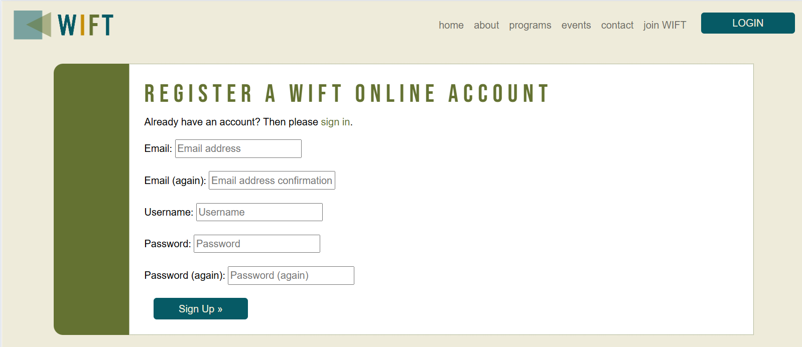

# WIFT - Women in Film and Television Application
  

  [View Live Project Here](https://wift-nsmith-c3ae5713a782.herokuapp.com/)
 
## Introduction
The Guild of Women in Film & Television - Ireland, or WIFT, website is a full-stack, e-commerce-based, web application created with HTML, CSS, JS, Python, the Django web framework and the Bootstrap library. This website application allows user to view the programs and events available to the creater WIFT community and encourages women in the industry to join the organisation for access to it's networking opportunities and access to educational and mentoring opportunities. Visitors to the website are able to view events, programs, and membership opportunities on the website. If the user chooses to join, they can select a membership level, register as a site user, and purchase this membership online. This purchase and registration allows the user to access a member dashboard that allows them to manage their personal details, their public profile published in a member directory, and to view that member directory as well as past membership purchases.

## CONTENTS  
  
* [User Experience](#user-experience)
  * [Project Goals](#project-goals)
  * [User Stories](#user-stories)
  * [Site Admin Stories](#site-admin-stories)
* [Agile Methodology](#agile-methodology)
  * [Kanban Board](#kanban-board)
  * [UI Design](#design)
  * [Database Design](#database-design)
* [Features](#features)
* [Future Development](#future-development)
* [Technologies](#technologies)
  * [Languages and Libraries Used](#languages-and-libraries-used)
  * [Technologies and Programs Used](#technologies-and-programs-used)
  * [Deployment](#deployment)
* [Testing](#testing)
* [Credits](#credits) 

  
---   

## User Experience
The goal of the WIFT website is to provide a business and membership management tool that allows this organisation to engage meaningfully with it's members and the greater film and television industry and supporters. The website offers information about WIFT events, programs, as well as membership opportunities that the visitor can purchase for additional access to the WIFT community and membership directory. Once the user registers on the website and purchases a membership, they can access and manage their personal information, create/view/edit/delete their public profile that is published in a membership directory only accessible to members.

I chose this very specific idea because I was approached by a similar Irish organisation to redesign their website. Although I declined to put in a proposal, I thought it was a good opportunity to apply the knowledge that I have gained from this course to solving some of the membership and access needs of an organisation like this. 

- ### Project Goals
  - Create a shopping cart system that allows clients to register for the site and purchase a membership with the WIFT organisation.
  - Create a website that offers information about on-going and up-coming events and programs relevant to women in the film and television industry.
  - Create a dashboard that member to manage their personal data and public profile (create/edit/delete) as well as view all their past membership purchases in a manageable way.
  - Create an admin portal where staff could manage the membership data of all the members, view membership purchases, and messages via the contact form.
  - Create a website that was responsive and attractive

- ### Visitor Goals
  As a user, I want to easily view upcoming events and programs as well membership options at WIFT and be able to purchase a membership as well as manage my personal information once I am a member.

- ### User Stories
  1. As a Site User, I cam view information about the organisation.
  2. As a Site User, I can view membership levels and benefits and find out how to sign up with WIFT.
  3. As a Site User, I want to view information on public programs and events so that I can attend or participate in WIFT events and programs.
  4. As a Potential Registered User, I can register for an account so that I can access begin the first step of membership.
  5. As a Registered User, I can easily log in or out or recover my password.
  6. As a Registered user, I receive an email confirmation after registering to verify that my account registration was successful.
  7. As a Registered User, I can purchase a specific membership based on my membership needs and professional level.
  8. As a Registered User, I can easily select a membership, view the selected membership in a shopping basket, and easily checkout.
  9. As a Registered user, I will see a confirmation that my purchase was successful and verify that I purchased the correct membership.
  10. As a Registered user, I will receieve an email confirmation after my purchase is complete and can keep this information for my records.
  11. As a visitor, I can see customized error pages for 404 and 500 errors so that I can understand what happened and take the appropriate action.

  ### Site Admin Stories
  1. As a site admin, I can create and manage personal information for the members of the WIFT organisation.
  2. As a site admin, I add/update/delete membership options so that the most updated membership options are available for the site users to purchase.
  3. As a Super User or Admin, I can access the admin panel/dashboard so that I can edit member information and make/edit/review/update/delete member data.
  4. As a Site admin, I can view messages sent to the organisaiton via the website contact form.

## Agile Methodology
The Agile Methodology was the project management approach used for this project. I attempted to break the project into phases and followed a cycle of planning, executing, and evaluating. I struggled with how to organise this properly on our Portfolio Project #4. So, I hope I was more successful with my final project.

All issues/user stories began in the Backlog section. As I got to a section, I moved issues from the backlog into the "Ready" section and as I began work on that specific issue, I moved it into the "In progress" section. As issues were resolved, they were moved into the "Done" column.

I also implemented the MoSCoW prioritisation scheme (Must Have, Should Have, Could Have, and Won't Have). 

- ### Kanban Board 
  I used the GitHub Project board to design and manage a [Kanban Board](https://github.com/users/hysinh/projects/6)
  

  
Kanban Board screenshot
  

  
  

- ### Issues
  I had 26 issues:
  - 3 Epics:
    - Epic 1:
      - Preliminary Work - Research / Planning for site development
    - Epic 2:
      - Web Development - Static pages
      - Web Dev Authorisation and Authentication
    - Epic 3:
      - Purchasing and Checkout
      - Member Admin
      - Web Admin
    - Epic 4:
      - Testing/Assessment
  - Must Haves
    - Edit/Update a member's private and public profiles as site admin
    - Easily update their private profile as a registered user
    - Have a personalised user profile as a registered user
    - View the selected membership level to be purchased in the basket as a vistor
    - Easily select the membership level that I want as a potential member
    - Purchase a membership as a registered user
    - Receive an email confirmation after registering as a registered user
    - Easily log in or log out as a registered user
    - Easily register for a user account as a potential member
    - View the levels of membership and benefits as a potential member
    - view information about the organisation as a site visitor
    - Research and design UX/UI
    - Write website content
    - Access the public pages
  - Should Haves
    - Easily renew my membership as a member
    - Easily see my membership level and when it was purchased
    - Receive an email confirmation after checkout
    - View a purchase confirmation after checkout
    - Feel my personal and payment information is safe and secure
    - Easily recover my password in case I forget it
    - Easily contact the organisation
    - Easily find the contact information for the organisation
    - Find information on public programs
    - Create User Stories
    - Create ERD - Entity Relationship Diagrams
    - Delete a member
    - View a Public version of the Membership list
  - Could Haves
    - View Public Events
    - Add/Edit/Delete WIFT events
    - Automated Testing

### UI Design
  I began my design phase with creating a flow chart, then designing the Entity Relationship Diagram for the database tables. After creating the flow of the website, I drew wireframes for the majority of the pages. Then I designed the user interface in Adobe Photoshop to set the style for the website. 

  

  
Flowchart
  
  
  
  

  

  
UX Wireframe 1
  

  
  

  

  
UX Wireframe 2
  

  
  

  

  
UX Wireframe 3
  

  
  

  

  
Entity Relationship Diagram
  
  
  
  

  

  
UI Mockup
  

  
  

  

  
Color Scheme
  

  
  

  #### Font Family
  For the body and majority of the website, Poppins was used for it's readability and versatility. For the main headers, I used Bebas Neue in upper caps. For the WIFT logo/brand, I used a font called US 101. I wanted an clean, strong, serif typeface that gave the brand the weight and modern look I wanted to convey for a contemporary but serious feeling.
  

  
Fonts
  

  
  

  #### Responsiveness
  The WIFT website needed to be responsive and available on a variety of screen sizes and devices to make it as accessible as possible. Although I made some small adjustments for sizes outside the ones listed below, I mainly focused on the following sizes:

  1. Mobile Device dimensions (larger): 375px and larger
  2. Tablet Device dimensions: 768px and larger
  3. Laptop Device dimensions: 992px and larger

### Database Design
Custom models were created for Venues, Bookings, and Contacts. A venue can have many bookings. A booking can only have one client and one venue.

Entity Relationship Diagrams
  

  

## Features
### Navbar - top navigation
The navbar incorporates the logo and a responsive navbar that collapses to a hamburger when a device is less than a tablet. The navigation options provide the user with all of their potential navigation options including registering as a user or logging into the user dashboard to create and/or manage bookings. If a user is logged in, their user name is displayed adjacent to the navbar.

Public navbar
  

Registered user navbar (logged in)

 

### Home Page
The Home page provides a featured image of Wimpleton House as well as brief details about the venue hire opportunities at the Wimpleton.

Home Page - Featured Image

Home Page - Venue Hire short descriptions

### Venue Hire Page
The Venue Hire page features details about each of the venue hire options available at the Wimpleton House. A visitor also can click on a button that directs them to the Booking form if they are logged in or to the sign in page if they are not already signed in or registered as a user. There are additional buttons at the end of each venue description that once clicked directs the user to the Booking form with that particular venue preselected in the booking form. Each of the venue images and descriptions are generated dynamically from the venues saved in the database.

Venue Hire page

Venue Hire - Venue Descriptions

### About Page
The About page provides basic information about Wimpleton House and emphasises it's versatility as a venue for hire for special events. Following the Wimpleton House details, there is a gallery that features images of various special events that were hosted previously at the Wimpleton House.

About page

### Contact Page
The Contact page features basic contact information for the Wimplton House including address and telephone details. The page also includes a google maps embedded into the page. The Contact page also features a email contact form that allows the vistor to ask questions or to send a message to the Wimpleton House staff by completing the form. The information is stored in the database and the messages accessible to staff members via the Admin panel.

Contact Page

Google Maps

Contact form

### Booking Dashboard
The Booking Dashboard is the hub for the user to create, manage, and delete bookings. The Booking Dashboard displays bookings dependent on their status (e.g. Approved, Pending approval, and Expired). The dashboard also features a button that direct the user to the Request Booking form. Once the user has created a booking request, the booking will be displayed in the dashboard in the appropriate section. The user should then be able edit or delete any active bookings with the status of Approved or Pending. Expired bookings are not editable by the user although they can be edited by an admin via the Admin panel.

Booking Dashboard

### Request Booking Form
This page allows the user to input the details of the venue they'd like to book. Users are requested to choose a venue (based on the a selection based on the approved Venues saved in the database), an event type (via preset choices), number of guests (a minumum of 20 guests and maximum of 500 guests), and the event date (only dates from 5 days in advance of the current date to two years out are accepted). The form validates the data and prints an error message corresponding with each field input box if the user inputs something that is not in line with the predetermined paramenters. A successful submission removes the venue with that particular event date from future bookings and returns the user to the Booking dashboard where they can see a success message.

Request Booking Form

Request Booking Error Messages Example

Request Booking Success Example

### Edit Booking Page
The Edit booking page is an option for any current and existing booking for that user. Expired bookings (in the past) are not editable by the user. The user is able to edit any of the booking details such as venue, event type, event date, and number of guests as long as they make changes that stay within the form's criteria. For example, if the user attempts to rebook the venue to a date that's already book, the user will not be allowed to change the booking.

Edit Booking page

Edit Booking success message

Edit Booking error message

### Delete Booking
A user can only delete bookings that both exist and are current. Expired bookings are not deletable by the user. When the user clicks on the delete button, a modal will open and the user must confirm that they wish to delete the booking or they are given the option to cancel the request. Once the user confirms, they are then redirected back to the Booking dashboard and will see a confirmation that they deleted their booking.

Delete Booking

Delete Booking Confirmation

### Sign In Page
A user is prompted to sign in when they attempt to make a booking.

Sign in Page

### Sign Out Page
The user can sign out at any point.

Sign Out Page

### Register Page
If the user wishes to make a booking and clicks on any of the booking buttons, they will be directed a register page where they can register or log in if they have already registered.

Register Page

### Footer
The footer contains links to the Venue Hire page, the About page, the Contact Page and the Home Page. It also contains two social media links to Facebook and Instagram. The Copyright information is also on the footer.

Footer

### 404 Error Page
If the user attempts to navigate to a non-existing page, the 404 Error page will display.

404 Error Page

### 500 Error Page
If there is a server error, a 500 Error page will display.

500 Error Page

### Future Development
- I think the error handling on the Edit Booking page could be better. I didn't realise until late in the testing phase that the form doesn't validate changes to the date and number of guests the same way it does for the Request Booking form. I changed the error message so that it works for current form but it doesn't give the user enough information about the specific problem. I didn't have enough time to figure out a better solution before this project concluded. In a future version, I would like to resolve this and provide better error messaging.
- I had hoped to delve deeper into unit testing and if time allowed, develop more comprehensive unit testing in the future.
- I had included a staff name and venue capacity on my Venue models. I had hoped to build a staff dashboard that would allow staff members to access the website from the front end and be able to create, edit, and delete venues as well as bookings. Although I wasn't able to implement this in version, I would like to develop this in the future.
- I also had hoped for this version to be able to implement a venue capacity limitation on the booking form. However, although I spent some time on this, I was not able to implement this function in the this current version and would hope that I can implement this in a future version.
- For my dates, I would implement a conversion of the DateTime object to the local timezone to account for potential clients visiting from locales outside the local timezone. This implementation would resolve discrepancies in timezone when booking.
- My mentor had suggested changing the name of my contact model (a web email form) from to "Email" to "Contact" as the form wasn't exactly an email. However, after implementing this change, I still think the name is slightly confusing as it displays in the admin dashboard as "Contacts" which doesn't convey what it really is either. Neither "Email" nor "Contact" conveyed exactly what it is. However, I chose to leave it for this version of the application and will probably update in the future to better convey it's purpose.

## Technologies
  ### Languages and Libraries Used
  - HTML, CSS, Javascript, Python, Django Web Framework, and Bootstrap Library
  - Django Crispy Forms, Django Summernote
  - Gunicorn 
  - Whitenoise - allows web app to serve static files

  ### Technologies and Programs Used
  - GitHub - used to save and store all the files for this website
  - GitPod and VSCode - was used as the IDE to develop and test the code for this website in both the cloud and locally.
  - Git - provided the version control
  - Heroku - provided the cloud deployment environment shell and Command Line Interface (CLI)
  - Cloudinary - Use for cloud storage of media files uploaded by the user
  - draw.io - used for flowchart creation
  - W3C HTML validator
  - W3C Jigsaw
  - Jshint Linter
  - Code Institute PEP8 Python Linter
  - https://www.drawio.com/ for Entity Relationship Diagramming
  - Adobe Photoshop - mockups and image editing
  - Google Lighthouse - SEO Assessments

  ### Deployment
  GitHub and Heroku was used to deploy this website using the Gitpod Code Institute template which preloads any required dependencies. The following steps were taken:

  
  1. Log into GitHub account. 
  2. Navigate to the project repository: [Wimpleton](https://github.com/hysinh/wimpleton-booking-app)
  3. Navigate to the CODE link on the navigation across the top.
  3. Then, navigate to the green CODE button on the right side and click.
  4. Select the Local tab and click on the copy icon to make a copy of the repository.
  5. Log into Heroku.com account.
  6. Navigate to the "New" button on the top right.
  7. Click on "New" and then click on "Create a new app".
  8. On the next page, create a unique App name for your deployment and choose a region. Then, click on the "Create app" button.
  9. Once your app has been created, it directs you to a new screen.
  10. Navigate across the top of the screen and click on the "Settings" tab.
  11. Navigate down the page and click on the "Reveal Config Vars" button.
  12. For the first key, type in "CLOUDINARY_URL" and then copy and paste the entirety of your cloudinary url file into the value box.
  13. For the second key, type in "DATABASE_URL" and then type in your unique Postgres database url in its corresponding value.
  14. Then in the third key, type in "SECRET_KEY" and your secret key in to the corresponding value.
  15. Under Buildpacks, add the <b>python</b> buildpack. 
  16. After this is complete, navigate to the Deploy tab from the menu across the top of the page. Click on "GitHub" under Deployment method and provide the required access when prompted.
  17. Choose Automatic or Manual deployment.
  18. Click "Deploy" when ready to deploy.

  #### How to clone the Wimpleton House Booking App & make changes:
  1. Open the [Wimpleton-House-Booking-App repository](https://github.com/hysinh/wimpleton-booking-app) on GitHub.
  2. Navigate to the CODE link on the navigation across the top.
  3. Then, navigate to the green CODE button on the right side and click.
  4. Select the Local tab and click on the copy icon to make a copy of the repository.
  5. Then navigate back to your main GitHub dashboard and then create a new repository with your desired name.
  6. On the next page, navigate to the bottom of the page and select Import code under "Import code from another repository".
  7. In the next window, paste the copied link of the [Wimpleton](https://github.com/hysinh/wimpleton-booking-app) into the line.
  8. Then, click Begin Import to import the repository code.
  9. Make changes and/or deploy as desired.
  10. This program requires the use of a postgres database, the Django Webframe work, Bootstrap CSS library, Django Crispy Forms, Gunicorn, Django Summernote and a Cloudinary account.

  ## Testing
  Please view all the testing documentation in [TESTING.md](TESTING.md)

  
## Credits
### Code
- Sandeep Aggarwal, my Code Institute Mentor, helped me write the maximum attribute for the code for my DateInput function.
- Jason Holt Smith helped me write the code in my Form Unit tests for the Venue which is a foreign key to my Booking model.
- I reused the delete modal used in in the Code Institute Django Blog walk through project

### Content
- https://fonts.google.com/
- https://fontawesome.com/  
- #### Images - [Pexels](https://www.pexels.com/) was my primary image source
  - Photo by Анна Хазова: https://www.pexels.com/photo/happy-friends-and-newlywed-couple-celebrating-wedding-at-night-5005252/
  - Photo by Dan Fuhrman: https://www.pexels.com/photo/beige-concrete-building-1076234/
  - Photo by Dominik Reiter: https://www.pexels.com/photo/gray-concrete-building-2169965/
  - Photo by Eugenia Remark: https://www.pexels.com/photo/bride-in-wedding-dress-posing-near-old-castle-15283360/
  - Photo by Ingo Joseph: https://www.pexels.com/photo/beige-painted-concrete-building-87378/
  - Photo by Jeremy Wong: https://www.pexels.com/photo/white-chairs-1082024/
  - Photo by Ahmed ツ: https://www.pexels.com/photo/tables-in-a-room-24023467/
  - Photo by Pixabay: https://www.pexels.com/photo/white-concrete-castle-surrounded-by-green-plants-50673/
  - Photo by Soner Görkem: https://www.pexels.com/photo/people-doing-wedding-party-6119578/
  - Photo by Pixabay: https://www.pexels.com/photo/steel-gate-of-brown-brick-building-159490/
  - Photo by Victoria Strelka_ph: https://www.pexels.com/photo/bride-and-groom-walking-towards-the-church-12194355/
- #### Code resources
  - Getting a json file output of object
    https://sentry.io/answers/creating-a-json-response-using-django-and-python/
  - Comparing dates - strings vs objects
    https://stackoverflow.com/questions/15311222/comparing-dates-stored-as-strings-in-django
  - Accessing django properties
    https://dev.to/doridoro/django-model-properties-28ac
  - How to compare dates in django
    https://stackoverflow.com/questions/3798812/how-to-compare-dates-in-django-templates
  - 404 custom and 500 pages with handler url
    https://stackoverflow.com/questions/20581017/django-custom-404-page-not-working

  