# Wimpleton House Booking Application
  Back to [README](https://github.com/hysinh/wift/blob/main/README.md)

## Testing Overview
## CONTENTS  

* [User Story Testing](#user-story-testing)
* [Testing](#testing)
  * [HTML Validation](#html-validation)
  * [CSS Validation](#css-validation)
  * [Javascript Validation](#javascript-validation)
  * [Python Validation](#python-validation)
  * [Google Lighthouse Audits](#google-lighthouse-audits)
  * [Unit Testing](#unit-testing)
  * [Manual Testing](#manual-testing)
  * [Bugs and Fixes](#bugs-and-fixes)
  * [Unfixed Bugs](#unfixed-bugs)

  
---   

## User Story Testing
| User Story | Pass/Fail |
| ---- | --------- |
| As a Site User, I can view information about the organisation so that I can get more information about the organisation. | Pass |
|  As a Site User, I can view membership levels and benefits so that I can quickly find out how to sign up for membership and the different levels of membership. | Pass |
|  As a Site User, I can find information on public programs such as the Fellowships and Mentorships so that I participate in educational and professional programs designed for the greater WIFT community. | Pass |
|  As a Site User, I can contact the organisation so that I can submit questions or queries to the organisation. | Pass |
|  As a Site User, I view public events so that I can attend WIFT events. | Pass |
| As a Potential Registered User, I can register for an account so that I can easily register for a user account as the first step of membership. | Pass |
| As a Registered User, I can seasily sign in or out so that I can purchase a membership or if I already purchased a member, can easily access my personal account information and the member directory. | Pass |
| As a Registered user, I can see that I am logged into the website on the navbar. | Pass |
| As a Registered user, I can easily recover my password in case I forget it so that I can recover access to my account. | Pass |
| As a Registered user, I will receive an email confirmation after registering so that I can verify that my account registration was successful. | Pass |
| As a Registered User, I can purchase a membership so that I can join the WIFT organisation. | Pass |
| As a Registered User, I can easily select the membership level that I want and easily make changes to my membership selection before checkout. | Pass |
| As a Registered user, I can view the selected membership level to be purchased and its annual cost in the basket. | Pass |
| As a Registered user, I can easily enter my payment information so that I can check out quickly and with no hassles. | Pass |
| As a Registered user, I can efeel my personal and payment information is safe and secure so that I can confidently provide the needed information to make a purchase. | Pass |
| As a Registered user, I can view an order confirmation after checkout so that I can verify that I have not made any mistakes in my purchase. | Pass |
| As a Registered user, I will receive an email confirmation after checkout so that I can keep the confirmation of my purchase for my records. | Pass |
| As an Active Member, I can have a personalised user profile so that I can view my membership level, records of membership purchases, and my user profile and public directory profile. | Pass |
| As an Active Member, I can easiliy update my private profile so that I keepy my personal account information up-to-date. | Pass |
| As an Active Member, I can easily update my publicly displayed profile so that I can update professional information to be displayed in the Membership Directory. | Pass |
| As an Active Member, I can easily delete my publicly displayed profile data so that I can delete the professional information to be displayed. | Pass |
| As an Active Member, I can easily see my membership level and when it was purchased and when it expires so that I can view my current membership levels and details of which memberships I had purchased before. | Pass |
| As an Active Member, I can see when my membership is going to expire so that I can easily renew my membership. | Pass |
| As a site admin, I can create and manage any booking so that I can manage the bookings for the venue | Pass |
| As a site admin, I add/update/delete members and their private and public data so that I can manage the member database | Pass |
| As a site admin, I can access the admin panel/dashboard so that I can update Membership categories, check for messages sent via the contact form, and view membership purchases. | Pass |

## Testing
### Validator Testing
This application was developed with HTML, CSS, Javascript, and Python using the Django Web Framework.
  - #### HTML Validation
    The [W3C HTML validator](https://validator.w3.org/) was used for the HTML validation. I copied the page source of the fully rendered page into the validator for testing.
    #### Public Pages
    

    
Home page (base.html and index.html)
  

    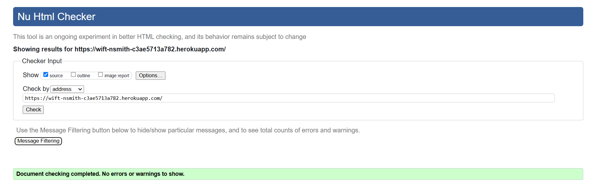
    

    

    
About page (about.html)
  

    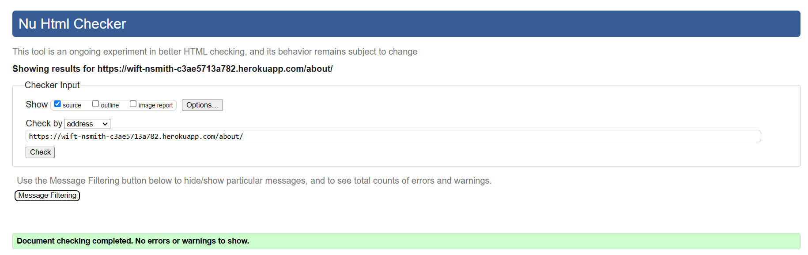
    

    

    
Events page (events.html)
  

    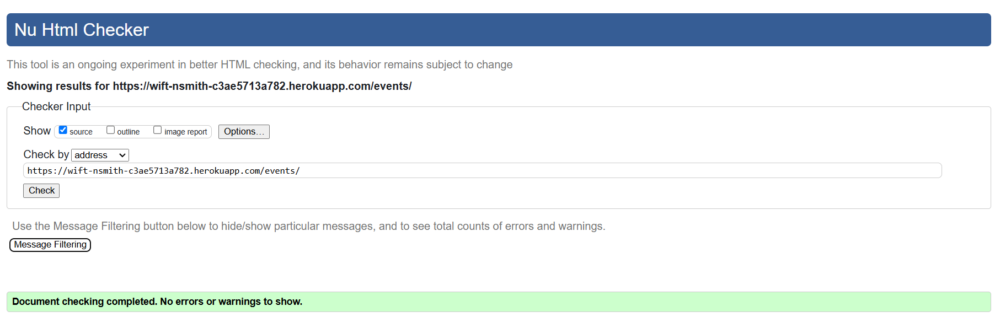
    

    

    
Fellowships page (fellowships.html)
  

    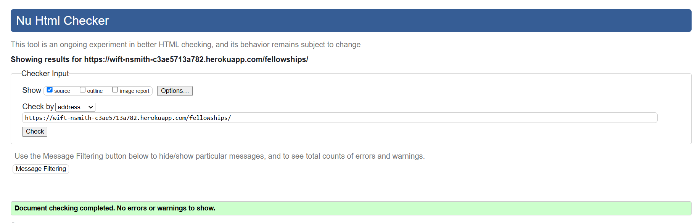
    

    

    
Mentoring page (mentoring.html)
  

    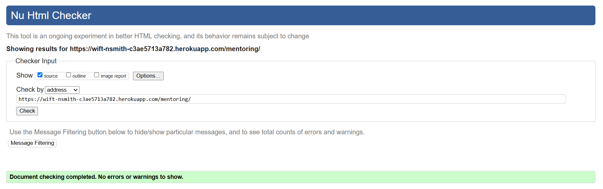
    

    

    
Contact page (contact.html)
  

    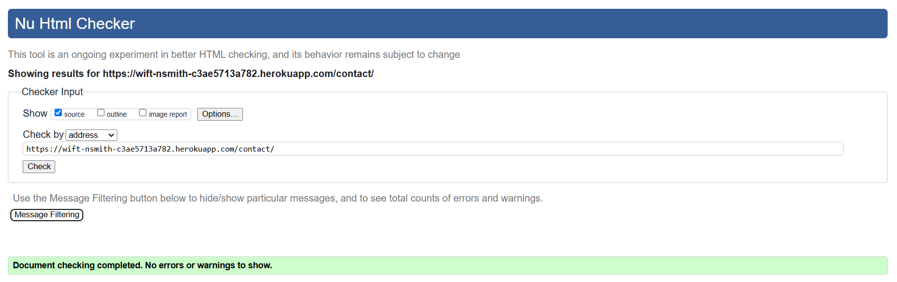
    

    

    
Sign up page (signup.html)
  

    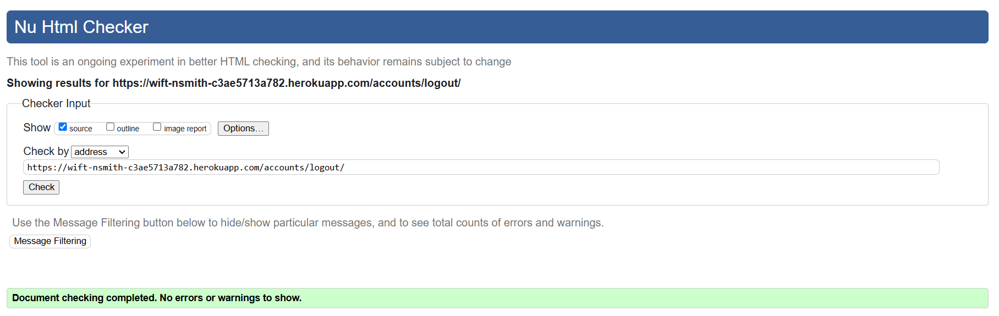
    

    

    
Sign In page (login.html)
  

    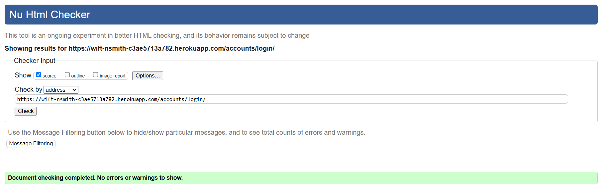
    

    

    
Log Out page (logout.html)
  

    
    
    

    #### Registered User Pages (Logged in)
    

    
Member Dashboard page (dashboard.html)
  

    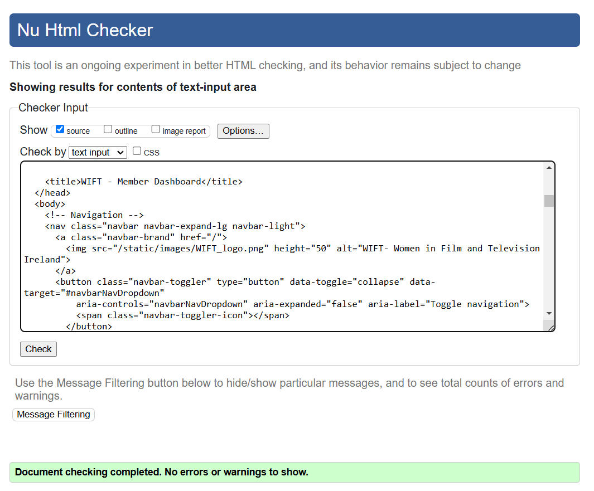
    

    

    
Membership Purchases page (membership_purchases.html)
  

    
    

    

    
Edit Account Info page (edit_private_data.html) - ERROR Detail - See error in the Unresolved Bugs Table below
  

    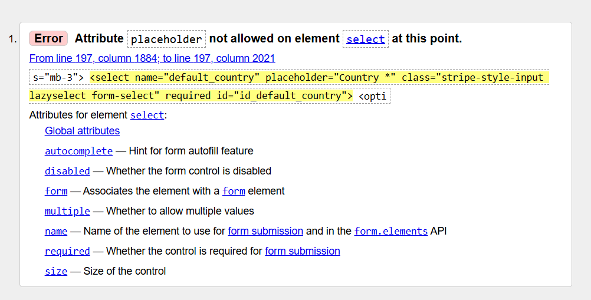
    

    

    
Sign out page (signout.html)
  

    
    

    

    
Sign up page (signup.html) - ERRORS Detail - See error in Linter Error Table below
  

    
    

    

    
Sign Up page (signup.html) - ERRORS Detail 2 - See error in Linter Error Table below
  

    
    

    
    #### Custom Error Pages
    

    
404 Error Page (404.html)
  

    
    

    

    
500 Error page (500.html)
  

    
    

    
  - #### CSS Validation
    I used the [W3C Jigsaw](https://jigsaw.w3.org/css-validator/) for CSS validation.
    

    
CSS Validation
  

    
    

  - #### Javascript Validation
    I used the [Jshint Linter](https://jshint.com/) for Javascript code validation.
    

    
Javascript Validation
  

    
    

  - #### Python Validation
    I used the [Code Institute PEP8 Python Linter](https://pep8ci.herokuapp.com/) for code validation. Unresolved bugs are noted in the bug table.
    #### Wimpleton Project
    

urls.py

    
    

    

settings.py

    
    

    #### Booking App
    

urls.py

    
    

    

views.py

    
    

    

models.py

    
    

    

forms.py

    
    

    

admin.py

    
    

    

test_forms.py

    
    

    

test_views.py

    
    

  ### Search Engine Optimization, Accessibility, Best Practices, & Performance
  - #### Google Lighthouse Audits
    Google Lighthouse was used to assess each page on it's performance, accessibility, Best Practices, and SEO. Using google fonts, font awesome as well as an Google maps embed all affected the performance of different pages as they are considered render-blocking resources. For my mobile performance assessments, the ratings were a little low due to the featured image file size. Although I used a smaller image set to 800px x 450px which affected the ratings only a little, the file size was still a bit larger than the Lighthouse standard. I decided that I didn't want to compromise the image size or quality further as it is an integral part of the website branding.
    #### Home Page
    - 

      
mobile
  

      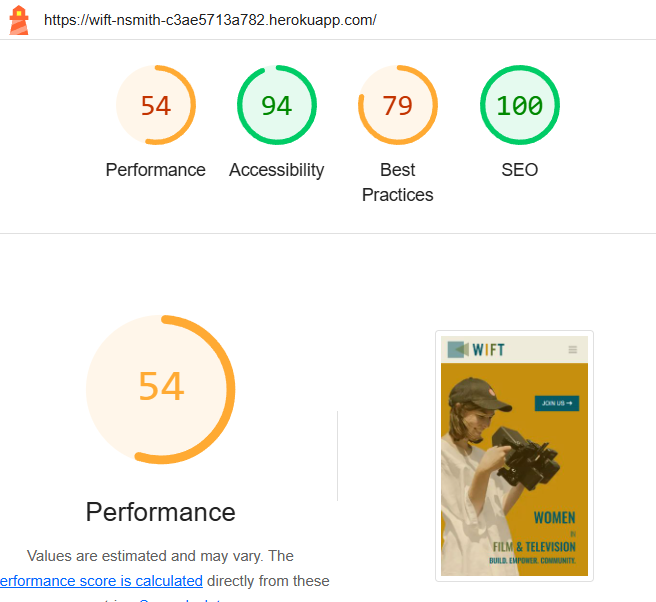
      

    - 

      
desktop
  

      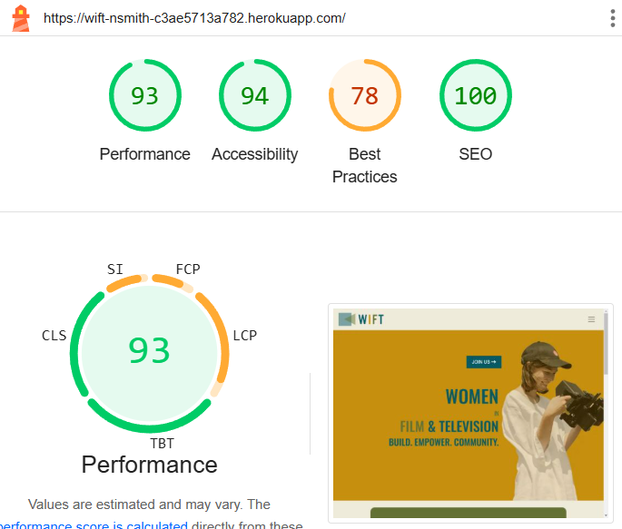
      

    #### Venue Hire Page
    Using images from Cloudinary had a big impact on Best Practices assessments as they are considered insecure requests. 
    - 

      
mobile
  

      
      

    - 

      
mobile - details
  

      
      
 
    - 

      
desktop
  

      
      

    #### About Page
    - 

      
mobile
  

      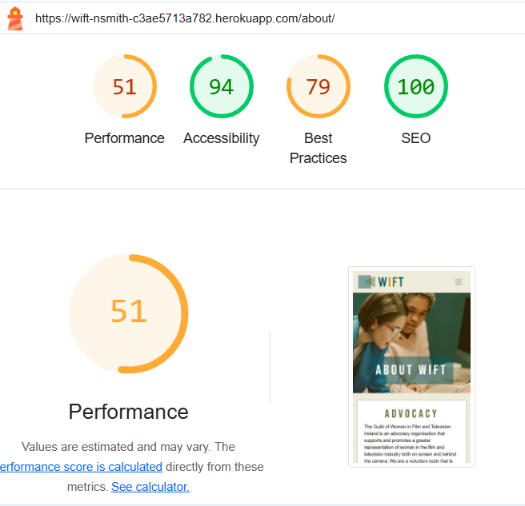
      

    - 

      
desktop
  

      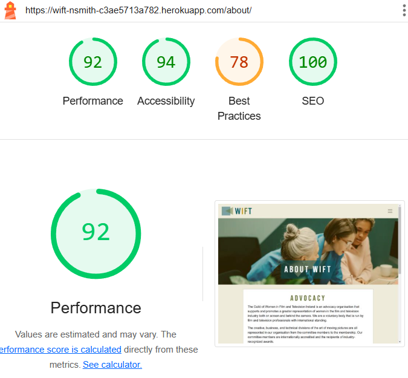
      

    
    #### Contact Page
    Best Practices assessment was affected by the Google Maps embed that I used in the contact information section.
    - 

      
mobile
  

      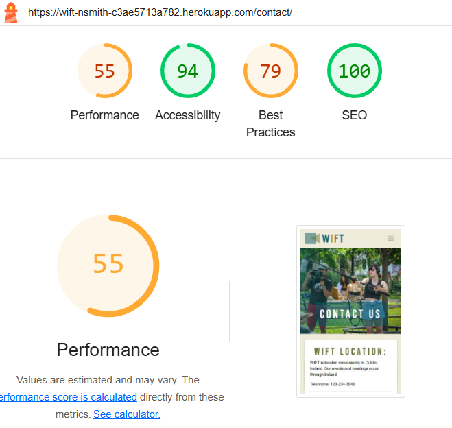
      

    - 

      
desktop
  

      
      

    - 

      
Best Practices detail - Google Maps
  

      
      

    #### Sign Up Page
    - 

      
mobile
  

      
      

    - 

      
desktop
  

      
      

    #### Sign in Page
    - 

      
mobile
  

      
      

    - 

      
desktop
  

      
      

    
    #### Registered User Pages (Logged in)
    #### Booking Dashboard page
    - 

      
mobile
  

      
      

    - 

      
desktop
  

      
      

    
    #### Request Booking page
    - 

      
mobile
  

      
      

    - 

      
desktop
  

      
      

    
    #### Edit Booking page
    - 

      
mobile
  

      
      

    - 

      
desktop
  

      
      

    #### Sign Out Page
    - 

      
mobile
  

      
      

    - 

      
desktop
  

      
      

    
    #### Custom Error Pages
    - 

      
404 Error Page - mobile
  

      
      

    - 

      
404 Error Page - desktop
  

      
      

    - 

      
500 Error page - mobile
  

      
      

    - 

      
500 Error page - desktop
  

      
      

  
  
  ### Unit Testing
  I was able to successfully execute unit testing on the booking form and the email contact form. 

  #### Unit Tests Run
  - Forms: Test EmailForm .is_valid()
  - Forms: Test EmailForm if no data
  - Forms: Test BookingForm .is_valid()
  - Forms: Test BookingForm if not data

  

Unit Testing Results

  
  
  

  ### Manual Testing
  Manual testing was performed on the website checking to ensure pages rendered correctly, input forms worked correctly, and a user was able to create, view, edit, and delete their bookings.

  #### Browsers
  Browser compatibility was checked on Google Chrome, Microsoft Edge, Brave, and Opera. For manual testing, the following browsers were used:
  1. Microsoft Edge
  2. Google Chrome
  3. Opera

  #### The results of testing are as follows:
  | Page | Test | Pass/Fail |
  | ---- | ---- | --------- |
  | Home page | Does the Home page load correctly? | Yes |
  | Home page (base.html) | Do all the navigation links work? | Yes |
  | | Do all the footer links work? | Yes |
  | | Is the user able to see a notification in the navbar that they are currently logged in? | Yes |
  | Venue Hire page | Does the Venue Hire page render correctly? | Yes |
  | | Do all the venues render correctly? | Yes |
  | | Does the generic booking link take you the booking form page (or Sign in page if not signed in? | Yes |
  | | Do each of the booking links at the bottom of each venue link correctly to the Booking form page and set the initial value for the venue in the form? | Yes |
  | About page | Does the About page render correctly? | Yes |
  | Contact page | Does the Contact page render correctly? | Yes |
  | | Does the Contact Email Contact form work correctly? | Yes |
  | | Does the Contact Email Contact form display error and confirmation messages appropriately? | Yes |
  | Venue Bookings page | Does the Venue Booking page correctly render the Booking Dashboard | Yes |
  | | Do approved, pending approval, and expired bookings display in the correct sections? | Yes |
  | | Does the Request a booking button work correctly? | Yes |
  | | Do the edit and delete bookings buttons work correctly? | Yes |
  | Request Booking page | Does the Request Booking page render correctly? | Yes |
  | | Does the Request Booking form work correctly and allow a user to request a booking? | Yes |
  | | Do the form error messages display correctly? | Yes |
  | | Does a successful request redirect correctly to the booking dashboard and display a success message? | Yes |
  | | Does the event date input validated and display the correct error handling? | Yes |
  | | Does the number of guests input validated and display the correct error handling? | Yes |
  | Edit Booking page | Does the Edit booking page render correctly? | Yes |
  | | Does the Edit booking page allow the user to edit a specific existing booking? | Yes |
  | | Is the input validated and display an error messages when not valid? | Yes |
  | Delete Booking button | Does the Delete booking button open a Deletion modal correctly? | Yes |
  | | Does the Delete booking button allow the user to delete a selected booking associated with that user? | Yes |
  | Register page | Does the Register user page render correctly? | Yes |
  | | Does the Register user page allow a visitor to register as a user? | Yes |
  | Sign out page | Does the Sign out page render correctly? | Yes |
  |  | Does the sign out page allow a user to sign out? | Yes |
  | 404 Error page | Does the 404 error page render correctly when visitor attempts to navigate to a page that doesn't exist? | Yes |
  | 500 Error page | Does the 500 error page render correctly when there is a server error | Yes |
  | Admin panel | Can only access the admin panel if any authorised user? | Yes |
  

  #### Bugs and Fixes
  | Bug | Page | Fix |
  | --- | ---- | --- |
  | The placeholder placed on the country field in the mode | Edit Account Info page | Updated error message to be more appropriate |
  | 500 Error message has wrong copy | 500 Error page | Updated error message to be more appropriate |
  | Parse error | styles.css | Remove errant character |
  | Family Name for font family | style.css | Add quotes around family name |
  | One undefined variable | bookings.js | Add "globals bootstrap" to top of code to remove warning |
  | Form method set to POST causing form errors on render | venue_list.html template | Change method to GET |

  
  ### Unfixed Bugs
  - Although there were some spots where I could have found a better solution, there were no bugs that I was able to find that I could not resolve unless otherwise noted.
  | The placeholder placed on the country field in the member private data model is not acceptable though it was something in the Boutique Ado walkthrough project. | Edit Account Info page | Updated error message to be more appropriate |
  
  ### Unresolved Linter Code Errors
  | Bug | Line | Unresolved Reason |
  | --- | ---- | --- |
  | There were a few places that were greater than the 79 character length max | settings.py - line 129 | Was unable to resolve as caused more errors when shortened |
  | There were a few places that were greater than the 79 character length max | views.py | Could not reduce error strings further and was unable to break up the line without causing further problems |
  | HTML errors | account/signup.html | These html errors were inside the built in Django signup form |