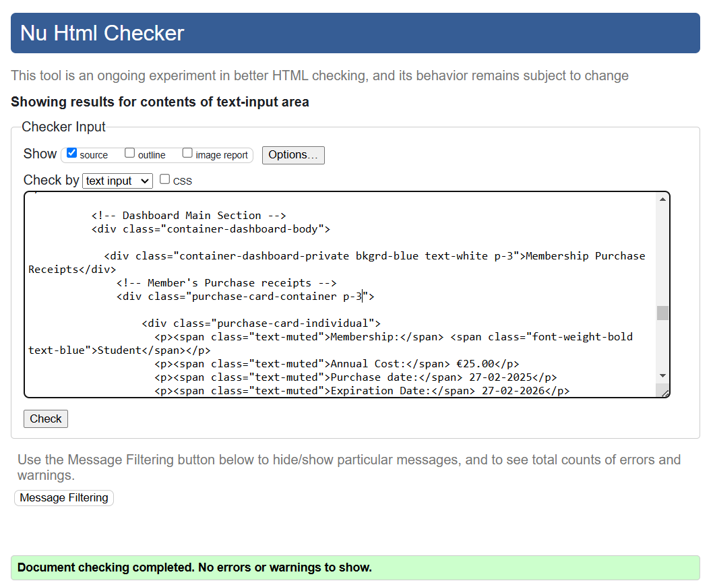
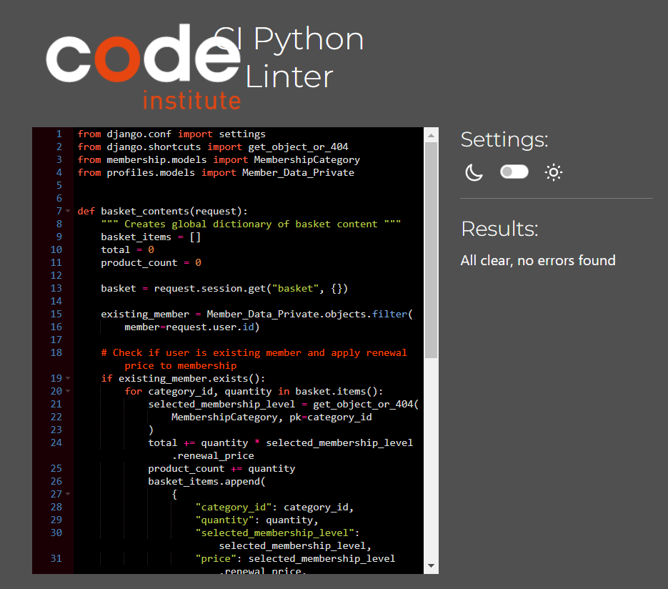
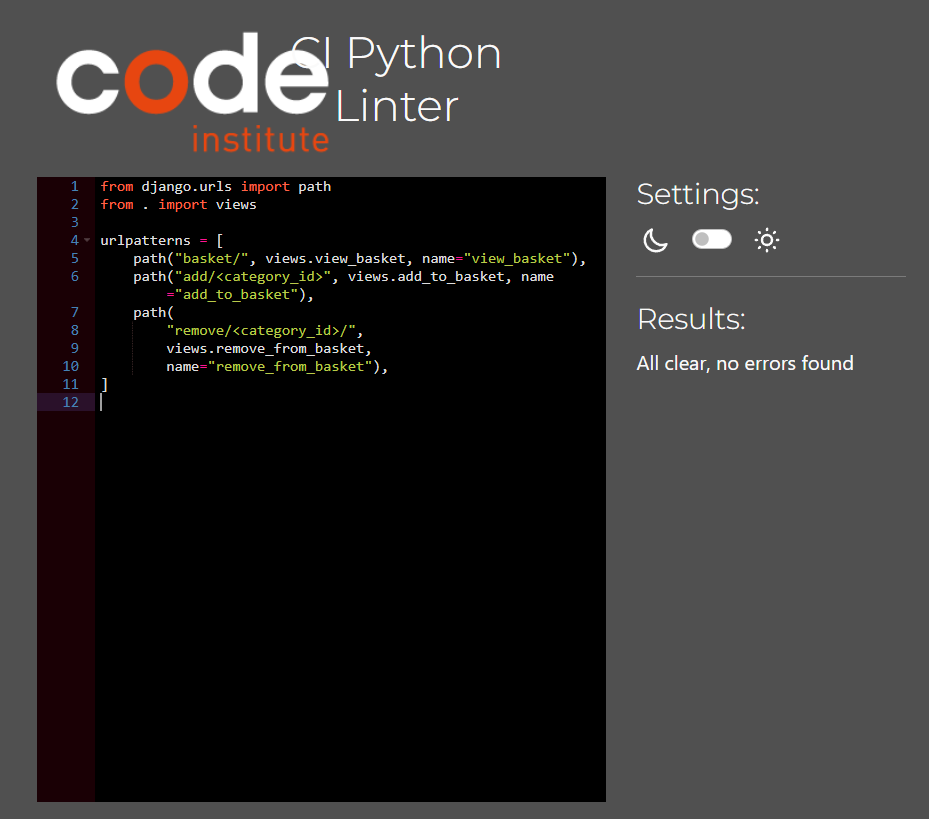
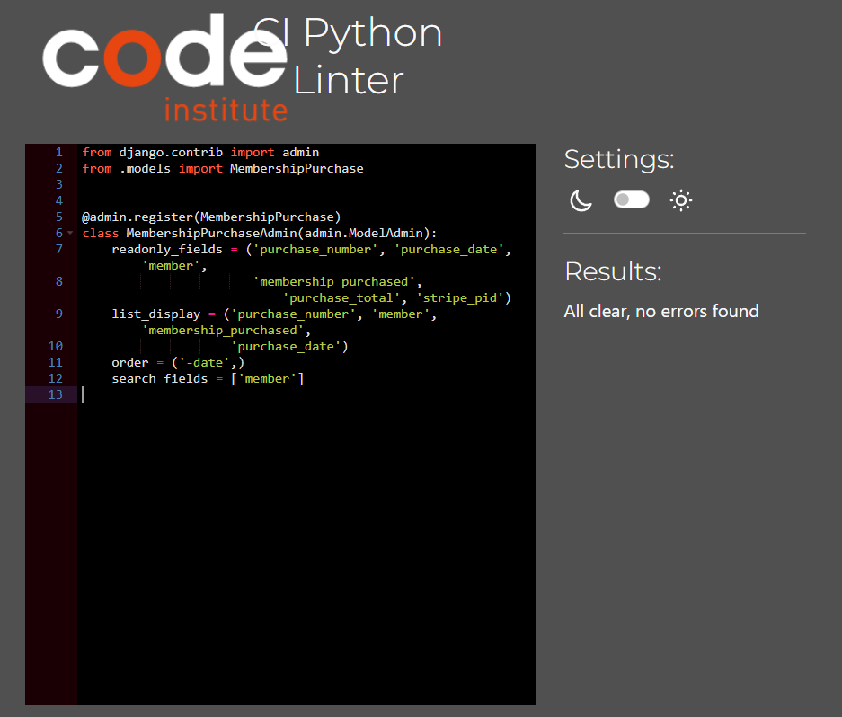

# WIFT - Guild of Women in Film and Television - Ireland Web Application
  Back to [README](https://github.com/hysinh/wift/blob/main/README.md)

## Testing Overview
## CONTENTS  

* [User Story Testing](#user-story-testing)
* [Testing](#testing)
  * [HTML Validation](#html-validation)
  * [CSS Validation](#css-validation)
  * [Javascript Validation](#javascript-validation)
  * [Python Validation](#python-validation)
  * [Google Lighthouse Audits](#google-lighthouse-audits)
  * [Unit Testing](#unit-testing)
  * [Manual Testing](#manual-testing)
  * [Bugs and Fixes](#bugs-and-fixes)
  * [Unfixed Bugs](#unfixed-bugs)

  
---   

## User Story Testing
| User Story | Pass/Fail |
| ---- | --------- |
| As a Site User, I can view information about the organisation so that I can get more information about the organisation. | Pass |
|  As a Site User, I can view membership levels and benefits so that I can quickly find out how to sign up for membership and the different levels of membership. | Pass |
|  As a Site User, I can find information on public programs such as the Fellowships and Mentorships so that I participate in educational and professional programs designed for the greater WIFT community. | Pass |
|  As a Site User, I can contact the organisation so that I can submit questions or queries to the organisation. | Pass |
|  As a Site User, I view public events so that I can attend WIFT events. | Pass |
| As a Potential Registered User, I can register for an account so that I can easily register for a user account as the first step of membership. | Pass |
| As a Registered User, I can seasily sign in or out so that I can purchase a membership or if I already purchased a member, can easily access my personal account information and the member directory. | Pass |
| As a Registered user, I can see that I am logged into the website on the navbar. | Pass |
| As a Registered user, I can easily recover my password in case I forget it so that I can recover access to my account. | Pass |
| As a Registered user, I will receive an email confirmation after registering so that I can verify that my account registration was successful. | Pass |
| As a Registered User, I can purchase a membership so that I can join the WIFT organisation. | Pass |
| As a Registered User, I can easily select the membership level that I want and easily make changes to my membership selection before checkout. | Pass |
| As a Registered user, I can view the selected membership level to be purchased and its annual cost in the basket. | Pass |
| As a Registered user, I can easily enter my payment information so that I can check out quickly and with no hassles. | Pass |
| As a Registered user, I can efeel my personal and payment information is safe and secure so that I can confidently provide the needed information to make a purchase. | Pass |
| As a Registered user, I can view an order confirmation after checkout so that I can verify that I have not made any mistakes in my purchase. | Pass |
| As a Registered user, I will receive an email confirmation after checkout so that I can keep the confirmation of my purchase for my records. | Pass |
| As an Active Member, I can have a personalised user profile so that I can view my membership level, records of membership purchases, and my user profile and public directory profile. | Pass |
| As an Active Member, I can easiliy update my private profile so that I keepy my personal account information up-to-date. | Pass |
| As an Active Member, I can easily update my publicly displayed profile so that I can update professional information to be displayed in the Membership Directory. | Pass |
| As an Active Member, I can easily delete my publicly displayed profile data so that I can delete the professional information to be displayed. | Pass |
| As an Active Member, I can easily see my membership level and when it was purchased and when it expires so that I can view my current membership levels and details of which memberships I had purchased before. | Pass |
| As an Active Member, I can see when my membership is going to expire so that I can easily renew my membership. | Pass |
| As a site admin, I add/update/delete members and their private and public data so that I can manage the member database | Pass |
| As a site admin, I can access the admin panel/dashboard so that I can update Membership categories, check for messages sent via the contact form, and view membership purchases. | Pass |
| As a site admin, I can view messages sent to WIFT via the contact form. | Pass |
| As a site admin, I can create/edit/delete membership categories so that they are current. | Pass |

## Testing
### Validator Testing
This application was developed with HTML, CSS, Javascript, and Python using the Django Web Framework.
  - #### HTML Validation
    The [W3C HTML validator](https://validator.w3.org/) was used for the HTML validation. I copied the page source of the fully rendered page into the validator for testing.
    #### Public Pages
    

    
Home page (base.html and index.html)
  

    
    

    

    
About page (about.html)
  

    
    

    

    
Events page (events.html)
  

    
    

    

    
Fellowships page (fellowships.html)
  

    
    

    

    
Mentoring page (mentoring.html)
  

    
    

    

    
Contact page (contact.html)
  

    
    

    

    
Sign up page (signup.html)
  

    
    

    

    
Sign In page (login.html)
  

    
    

    

    
Log Out page (logout.html)
  

    
    
    

    #### Basket and Checkout Pages
    

    
Basket Page (basket.html)
  

    
    

    

    
Checkout Page (checkout.html) - ERROR Detail - See error in the Unresolved Bugs Table
  

    
    

    

    
Checkout Existing Member Page (checkout_existing_member.html) - ERROR Detail - See error in the Unresolved Bugs Table
  

    
    

    

    
Checkout Success Page (checkout_success.html)
  

    
    

    

    
Checkout Renewal Success Page (checkout_success_renewal.html)
  

    
    

    #### Registered User Pages (Logged in)
    

    
Member Dashboard page (dashboard.html)
  

    
    

    

    
Membership Purchases page (membership_purchases.html)
  

    
    

    

    
Edit Account Info page (edit_private_data.html) - ERROR Detail - See error in the Unresolved Bugs Table below
  

    
    

    

    
Create Public Profile page (create_public_data.html) 
  

    
    

    

    
Edit Public Profile page (edit_public_data.html) 
  

    
    

    

    
Member Directory page (member_directory.html) 
  

    
    

    
    
    #### Custom Error Page
    

    
404 Error Page (404.html)
  

    
    

    
  - #### CSS Validation
    I used the [W3C Jigsaw](https://jigsaw.w3.org/css-validator/) for CSS validation.
    

    
base.css
  

    
    

    

    
checkout.css
  

    
    

    

    
profiles.css
  

    
    

  - #### Javascript Validation
    I used the [Jshint Linter](https://jshint.com/) for Javascript code validation.
    

    
stripe_elements.js
  

    
    

    

    
profiles.js
  

    
    

  - #### Python Validation
    I used the [Code Institute PEP8 Python Linter](https://pep8ci.herokuapp.com/) for code validation. Unresolved bugs are noted in the bug table.
    #### WIFT Project
    

urls.py

    
    

    

settings.py

    
    

    

views.py

    
    

    #### Basket App
    

apps.py

    
    

    

contexts.py

    
    

    

urls.py

    
    

    

views.py

    
    

  

    #### Checkout App
    

admin.py

    
    

    

forms.py

    
    

    

models.py

    
    

    

urls.py

    
    

    

views.py - ERRORS - See errors in the Unresolved Bugs Table below

    
    

    

webhook_handler.py

    
    

    

webhooks.py

    
    

    

    #### Home App
    

admin.py

    
    

    

forms.py

    
    

    

models.py

    
    

    

urls.py

    
    

    

views.py

    
    

    #### Membership App
    

admin.py

    
    

    

forms.py

    
    

    

models.py

    
    

    

urls.py

    
    

    

views.py

    
    

    #### Profiles App
    

admin.py

    
    

    

forms.py

    
    

    

models.py

    
    

    

urls.py

    
    

    

views.py

    
    

  ### Search Engine Optimization, Accessibility, Best Practices, & Performance
  - #### Google Lighthouse Audits
    Google Lighthouse was used to assess each page on it's performance, accessibility, Best Practices, and SEO. Using Google fonts, Bootstrap, Font Awesome as well Stripe greatly affected the performance of the majority pages especially on the mobile size as they are considered render-blocking resources. I swapped out all my images to smaller images which only affected the ratings slightly. Stripe's cookies also greatly decreased the Best Practices ratings.
    #### Home Page
    - 

      
mobile
  

      
      

      

      
mobile - details
  

      
      

    - 

      
desktop
  

      
      

    #### About Page
    - 

      
mobile
  

      
      

    - 

      
desktop
  

      
      

    #### Fellowships Page
    - 

      
mobile
  

      
      

    - 

      
desktop
  

      
      

    
    #### Mentoring Page
    - 

      
mobile
  

      
      

    - 

      
desktop
  

      
      

    #### Events Page
    - 

      
mobile
  

      
      

    - 

      
desktop
  

      
      

    #### Contact Page
    - 

      
mobile
  

      
      

    - 

      
desktop
  

      
      

    #### Join Page
    - 

      
mobile
  

      
      

    - 

      
desktop
  

      
      

    #### Basket Page
    - 

      
mobile
  

      
      

    - 

      
desktop
  

      
      

    #### Checkout Page
    Stripe's payment form greatly affected the load time of this page on both the mobile and desktop.
    - 

      
mobile
  

      
      

    - 

      
desktop
  

      
      

    #### Checkout Success Page
    Stripe's payment form greatly affected the load time of this page on both the mobile and desktop.
    - 

      
mobile
  

      
      

    - 

      
desktop
  

      
      

    #### Registered User Pages (Logged in)
    #### Dashboard Page
    - 

      
mobile
  

      
      

    - 

      
desktop
  

      
      

    #### Purchase Receipts Page
    - 

      
mobile
  

      
      

    - 

      
desktop
  

      
      

    #### Edit Account Info Page
    - 

      
mobile
  

      
      

    - 

      
desktop
  

      
      

    #### Create Public Profile Page
    - 

      
mobile
  

      
      

    - 

      
desktop
  

      
      

    #### Member Directory Page
    - 

      
mobile
  

      
      

    - 

      
desktop
  

      
      

  
  
  ### Unit Testing
  I did not write unit tests for this project.

  ### Manual Testing
  Manual testing was performed on the website checking to ensure pages rendered correctly, input forms worked correctly, and a user was able to register for an account, purchase a membership, and modify their account information from the member dashboard.

  #### Browsers
  Browser compatibility was checked on Google Chrome, Microsoft Edge, Brave, and Opera. For manual testing, the following browsers were used:
  1. Microsoft Edge
  2. Google Chrome
  3. Opera

  #### The results of testing are as follows:
  | Page | Test | Pass/Fail |
  | ---- | ---- | --------- |
  | Home page | Does the Home page load correctly? | Yes |
  | Home page (base.html) | Do all the navigation links work? | Yes |
  | | Do all the footer links work? | Yes |
  | | Is the user able to see a notification in the navbar that they are currently logged in? | Yes |
  | | Does the generic login link take you the member dashboard if user has an active membership or redirects to the join page to purchase a membership (or Sign in page if not signed in?) | Yes |
  | | Do each of the membership category links add the correct membership and cost to the basket? | Yes |
  | About page | Does the About page render correctly? | Yes |
  | Fellowships page | Does the Fellowships page render correctly? | Yes |
  | Mentoring page | Does the Mentoring page render correctly? | Yes |
  | Events page | Does the Events page render correctly? | Yes |
  | Contact page | Does the Contact page render correctly? | Yes |
  | | Does the Contact Email Contact form work correctly? | Yes |
  | | Does the Contact Email Contact form display error and confirmation messages appropriately? | Yes |
  | Join page | Does the Join page render correctly? | Yes |
  | | Do each of the membership categories render correctly? | Yes |
  | | Does the Join Us link at the top jump to the correct anchor point lower in the page? | Yes |
  | | Do each of the membership level links correctly add the membership and directs the user to the basket? | Yes |
  | | Does a message appear in the top corner when the user selects a membership to confirm it was added to their basket? | Yes |
  | Basket page | Does the Shopping Basket page render correctly? | Yes |
  | | Does the shopping basket display the user-selected membership level and it's corresponding annual cost? | Yes |
  | | Does the empty basket link work correctly and display an empty basket? | Yes |
  | | Does change selection link correctly send the user back to the Join page to make a different membership selection? | Yes |
  | | If the user is already a member, are they directed to their member dashboard instead of the Checkout Page when they click on the "Secure Checkout" button? | Yes|
  | Checkout page | Does the Checkout page correctly render? | Yes |
  | | Does the user-selected membership level and cost display correctly at the top of the page? | Yes |
  | | Does the Member Private Data form display correctly? | Yes |
  | | Does the Stripe payment input form appear correctly? | Yes |
  | | Do error message appear when the form entry is invalid for required fields? | Yes |
  | | Does the form submit correctly and process the order in the database when user clicks on the "Purchase" button? | Yes |
  | | Does the form submit the payment correctly to Stripe and correctly process the payment? | Yes |
  | | Does the page correctly display a the renewal rate if the User already has a previous membership? | Yes |
  | | Does the form correctly submit the renewal rate if the User is already a previous member? | Yes | 
  | Purchase Success page | Does the Purchase Success page render correctly? | Yes |
  | | Does the purchase information display correctly on the page? | Yes |
  | | Does the renewal date display correctly? | Yes |
  | | Does the "Dashboard" Button correctly direct the user to the Member Dashboard? | Yes |
  | Dashboard Page | Does the Dashboard Page render correctly? | Yes |
  | | Does the dashboard navigation display personalised information about the member? | Yes |
  | | Does the dashboard display the correct member account details? | Yes |
  | | Does the dashboard display the most recent membership purchase informaton? | Yes |
  | | Does the dashboard dispaly the member's public profile if they have created one? | Yes |
  | | Does each of the dashboard navigation direct the member to the correct page? | Yes |
  | Dashboard - Purchase Receipts | Does the Purchase receipt page display all the membership purchases for the member? | Yes |
  | | Does the purchase receipts display the correct purchase and renewal dates? | Yes |
  | Dashboard - Edit Account Information | Does the Edit Account Info page render correctly? | Yes |
  | | Does the form display the correct member information? | Yes |
  | | Is the member able to edit their account information and save it? | Yes |
  | | Is the input validated and display an error messages when not valid? | Yes |
  | Dashboard - Create/Edit Public Profile Page | Does the Create/Edit Public Profile page render correctly? | Yes |
  | | Does the form validate the entries and display an error message for invalid entries? | Yes |
  | | Does the Delete button open a delete modal to ensure the member is sure about deleting their data? | Yes |
  | | Does the Delete button allow the member to delete their associated Public Profile data? | Yes |
  | | Does the cancel button return the member to their member dashboard? | Yes |
  | Dashboard - Member Directory | Does the Member Directory display correctly? | Yes |
  | | Does the member directory display all of the public profiles of members alphabetically? | Yes |
  | Register page | Does the Register user page render correctly? | Yes |
  | | Does the Register user page allow a visitor to register as a user? | Yes |
  | Sign out page | Does the Sign out page render correctly? | Yes |
  |  | Does the sign out page allow a user to sign out? | Yes |
  | 404 Error page | Does the 404 error page render correctly when visitor attempts to navigate to a page that doesn't exist? | Yes |
  | Admin panel | Can only superusers access the admin panel? | Yes |
  

  #### Bugs and Fixes
  | Bug | Page | Fix |
  | --- | ---- | --- |
  | Button element could not be a child of an < a > element | base.html | Reconfigure so that button was removed and styling applied to < a > to maintain look of button |
  | Extra div tag element | Member Directory page | Remove element |
  | Extra div tag element | Membership Purchase Receipts page | Remove element |
  | A table row was 1 columns wide, which is less than the column count established by the first row | checkout_success.html, checkout_success_renewal.html | Add colspan attribute | 

  
  ### Unfixed Bugs
  | Bug | Line | Unresolved Reason |
  | --- | ---- | --- |
  | Bootstrap background color on drop down menu is blue | base.css | I had originally set the background color to white but when testing on the last day, I noticed that the visted background colour was blue behind the drop down item on the navigation. I attempted to override the Bootstrap styles with a class but could not get the desired white background. I was unable to resolve this in the time constraint that I had for this project. |
  | When the toasts are closed, it leaves behind a small white circle on the top of the page which disappears upon refresh | Toasts | I attempted to find the root of this but was unable to figure out why this circle appears or how to remove it. | 
  | Webhook does not save my member private data object in the backup method from Stripe | webhook_handler.py | Although my webhook handler saves my membership purchase data in the event that it was not saved in the initial Stripe order process, my backup method does not save the second database entry for the member's private data. Unfortunately, I designed the membership dashboard to require this information to display correctly. At the moment, if a purchase must rely on the backup method in the webhook handler for creation, the member can access their member dashboard, but they will not see the dashboard navigation display. They would need to contact the WIFT organisation and a site admin would have to manually create the private member data information in the database. I was not able to resolve this in the time that I had. |
  
  
  ### Unresolved Linter Code Errors
  | Bug | Page | Unresolved Reason |
  | --- | ---- | --- |
  | The placeholder set on select option for the country field for the form caused an error. | edit_private_data.html - line 197 | I attempted to remove the blank label from the country field in the Member Private Data model but it did not resolve the issue. I think that it is something that is part of django countryfield module that I could not resolve. |
  | The placeholder set on select option for the country field for the form caused an error. | checkout/checkout.html - line 95, checkout/checkout_existing_member.html - line 92 | This was bug was not resolved. Please see line above for reason. |
  | h1 tag with no content | checkout/checkout.html - line 131, checkout/checkout_existing_member.html - line 128 | The h1 tag is used to hold the loading spinner. This was loading spinner solution was derived from the Boutique Ado project, I chose to leave the code as it was and will resolve this in a future version.
  | There were a few places that were greater than the 79 character length max | checkout/views.py - 1, 75, 109, 111  | Was unable to shorten the lines to resolve as caused more errors when shortened |
  